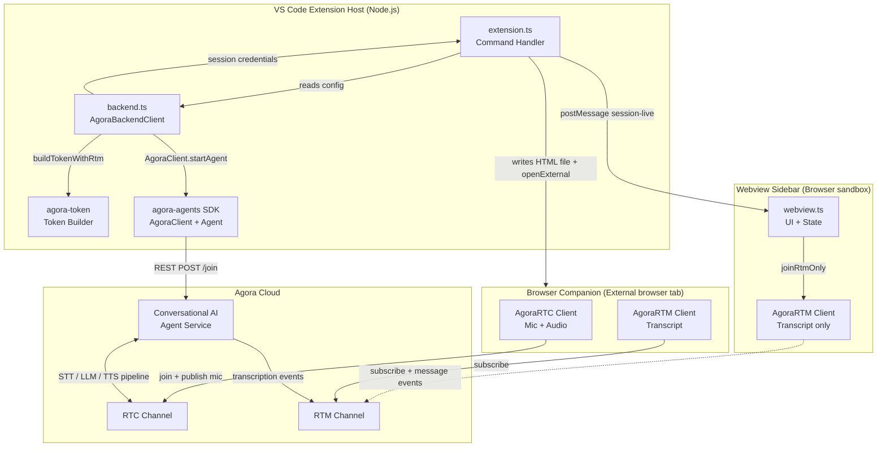
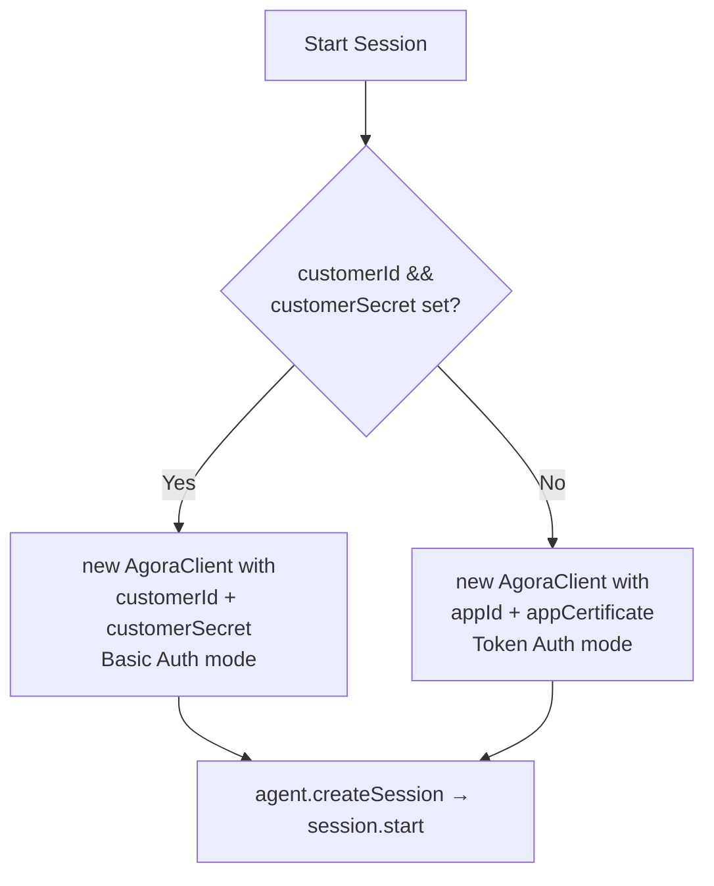
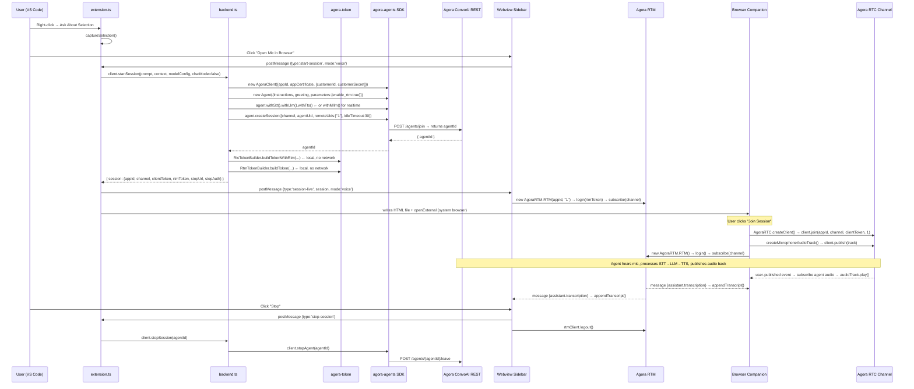
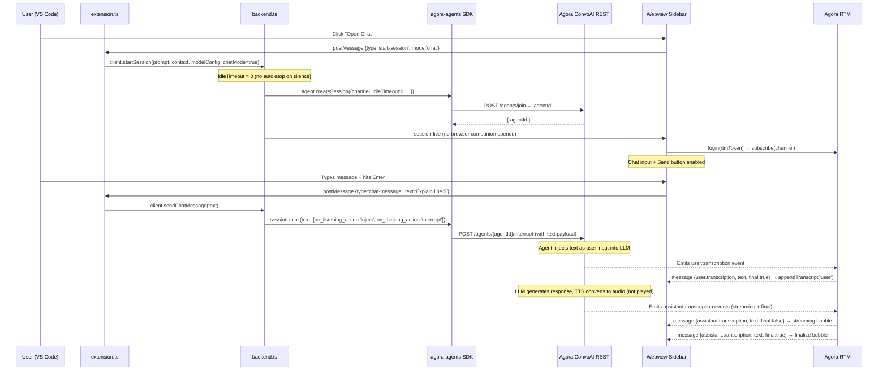
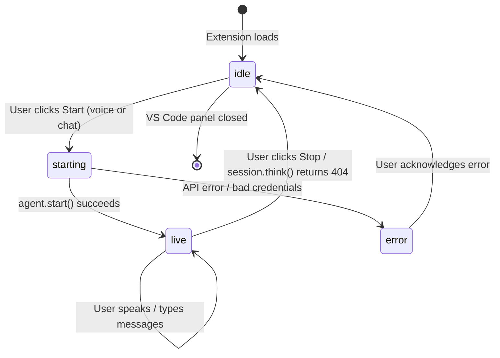

# Agora Integration — Complete Reference

> **Extension:** Agora Mentor (v0.1.2)  
> **Purpose:** VS Code extension that starts a real-time conversational AI agent against selected code, supporting both voice (microphone + speaker) and text chat modes.

---

## 1. Agora Products Used

| Product | SDK / Library | Version | Where Used |
|---|---|---|---|
| **Conversational AI (ConvoAI)** | `agora-agents` (Node.js) | 2.4.0 | Extension host — starts/stops the AI agent |
| **Real-Time Communication (RTC)** | `AgoraRTC_N.js` (browser) | 4.20.2 | Browser companion — mic capture + agent audio playback |
| **Real-Time Messaging (RTM)** | `agora-rtm.js` (browser + webview) | 2.2.3 | Transcript delivery to both sidebar and companion |
| **Token Builder** | `agora-token` (Node.js) | ^2.0.5 | Extension host — mints RTC and RTM access tokens |

---

## 2. Architecture Overview



---

## 3. Authentication

The extension supports **two auth modes** for the ConvoAI REST API:

### 3a. Token Auth (default)
- Uses `appId` + `appCertificate` only.
- The `agora-agents` SDK derives a ConvoAI token internally.

### 3b. Basic Auth (preferred when credentials are set)
- Requires `customerId` + `customerSecret` from Agora Console → RESTful API keys.
- Sent as `Authorization: Basic base64(customerId:customerSecret)` header on every ConvoAI request.
- `stopUrl` + `stopAuth` are pre-computed in the extension host and passed to the browser companion so it can call the stop endpoint directly without exposing the certificate.



---

## 4. Configuration (VS Code Settings)

| Setting Key | Type | Default | Description |
|---|---|---|---|
| `agoraMentor.appId` | string | `""` | 32-char hex Agora App ID |
| `agoraMentor.appCertificate` | string | `""` | 32-char hex App Certificate (used locally only, never sent to browser) |
| `agoraMentor.agentUid` | string | `"123456"` | RTC UID reserved for the AI agent |
| `agoraMentor.geofence` | string | `"us"` | ConvoAI routing area: `us` / `eu` / `ap` / `cn` |
| `agoraMentor.customerId` | string | `""` | Optional: RESTful API Customer ID |
| `agoraMentor.customerSecret` | string | `""` | Optional: RESTful API Customer Secret |

---

## 5. Session Modes

### 5a. Cascading Voice Mode (`mode: 'cascading'`)
STT → LLM → TTS pipeline. Three separate, swappable providers.  
Audio flows over the **RTC channel**. Transcripts arrive via **RTM**.  
Microphone lives in the **browser companion** (opens in system browser).

### 5b. Realtime Speech Mode (`mode: 'realtime'`)
A single multimodal LLM (MLLM) handles STT + LLM + TTS in one model (e.g. OpenAI Realtime API or Gemini Live).  
Same transport: RTC for audio, RTM for transcripts.

### 5c. Text Chat Mode (`mode: 'chat'`)
**No microphone or audio.** The user types in the sidebar.  
The extension calls `session.think()` on the ConvoAI agent which injects text directly into the LLM pipeline.  
Responses arrive as `assistant.transcription` RTM events.  
`idleTimeout` is set to `0` so the agent never auto-stops due to silence.

---

## 6. APIs Called — Complete List

### 6a. `agora-agents` SDK (ConvoAI REST, called from Node.js extension host)

| When | Method | Underlying REST endpoint | Description |
|---|---|---|---|
| Start session | `session.start()` | `POST https://api.agora.io/api/conversational-ai-agent/v2/projects/{appId}/agents/join` | Starts the AI agent, returns `agentId` |
| Stop session | `client.stopAgent(agentId)` | `POST https://api.agora.io/api/conversational-ai-agent/v2/projects/{appId}/agents/{agentId}/leave` | Stops and destroys the agent |
| Send chat message | `session.think(text, options)` | `POST https://api.agora.io/api/conversational-ai-agent/v2/projects/{appId}/agents/{agentId}/interrupt` (internal) | Injects user text into LLM; ConvoAI handles token generation |

### 6b. `agora-token` SDK (local, no network call)

| When | Method | Purpose |
|---|---|---|
| During `startSession` | `RtcTokenBuilder.buildTokenWithRtm(appId, cert, channel, uid, role, tokenTTL, rtmTTL)` | Mints `AccessToken2` for the browser client to join the RTC channel |
| During `startSession` | `RtmTokenBuilder.buildToken(appId, cert, uid, expiresAtTimestamp)` | Mints `AccessToken v1` for RTM channel subscription |

### 6c. AgoraRTC Web SDK (browser companion, `AgoraRTC_N.js@4.20.2`)

| When | Call | Description |
|---|---|---|
| User clicks "Join Session" | `AgoraRTC.resumeAudioContext()` | Unlocks Web Audio context (browser autoplay policy) |
| Join | `AgoraRTC.createClient({ mode: 'rtc', codec: 'vp8' })` | Creates RTC client |
| Join | `client.join(appId, channel, clientToken, clientUid)` | Joins the channel as UID=1 |
| Join | `AgoraRTC.createMicrophoneAudioTrack({ encoderConfig: 'speech_low_quality' })` | Captures microphone |
| Join | `client.publish(track)` | Publishes mic audio into the channel |
| Agent audio | `client.subscribe(user, 'audio')` | Subscribes to agent's published audio |
| Agent audio | `user.audioTrack.play()` | Plays agent voice through speakers |
| Mute | `track.setEnabled(false/true)` | Toggles microphone |
| Volume meter | `track.getVolumeLevel()` | Polls mic volume (100ms interval) |
| Page unload | `track.stop(); track.close(); client.leave()` | Cleans up RTC resources |

**Events listened on RTC client:**
| Event | Handler |
|---|---|
| `user-published` | Subscribes to agent's audio track |
| `user-left` | Detects agent departure → shows "Session ended by VS Code" |
| `stream-message` | Receives chunked transcript packets (when RTM is not available) |

### 6d. AgoraRTM Web SDK (browser companion + webview sidebar, `agora-rtm.js@2.2.3`)

| When | Call | Description |
|---|---|---|
| Session live | `new AgoraRTM.RTM(appId, uid)` | Creates RTM client |
| Session live | `rtmClient.login({ token: rtmToken })` | Authenticates with RTM service |
| Session live | `rtmClient.subscribe(channel)` | Subscribes to the session channel |
| Message event | `rtmClient.addEventListener('message', handler)` | Listens for `assistant.transcription` / `user.transcription` events |
| Stop | `rtmClient.removeEventListener(...)` + `rtmClient.logout()` | Cleans up RTM subscription |

**RTM Message Payloads (JSON):**
```json
// assistant.transcription
{ "object": "assistant.transcription", "text": "Here is what the code does…", "turn_id": "42", "final": true }

// user.transcription  
{ "object": "user.transcription", "text": "Can you explain line 5?", "turn_id": "41", "final": true }
```

### 6e. Stop via Direct REST (browser companion, on page unload)

The browser companion calls the stop endpoint directly (with `keepalive: true`) so it fires even when the tab is closed:

```
POST {stopUrl}   →   https://api.agora.io/api/conversational-ai-agent/v2/projects/{appId}/agents/{agentId}/leave
Authorization: Basic {base64(customerId:customerSecret)}   OR   (empty if token-auth only)
Content-Type: application/json
```

---

## 7. Token Details

| Token | Builder | Format | Expire |
|---|---|---|---|
| **RTC client token** | `RtcTokenBuilder.buildTokenWithRtm` (AccessToken2) | includes RTM privileges | 3600 seconds (1 hour) |
| **RTM token** | `RtmTokenBuilder.buildToken` (AccessToken v1) | absolute Unix timestamp | 3600 seconds from mint time |
| **ConvoAI session token** | Generated internally by `agora-agents` SDK | N/A — not exposed | Set via `ExpiresIn.seconds(3600)` |

- **Client UID:** always `1` (numeric, hardcoded as `CLIENT_UID`)  
- **Agent UID:** configurable via `agoraMentor.agentUid`, default `"123456"`  
- **Channel name:** dynamically generated: `mentor-{timestamp}-{6-char-random}` (e.g. `mentor-1720790400123-ab3xyz`)

---

## 8. Voice Mode — Complete API Call Sequence



---

## 9. Chat Mode — Complete API Call Sequence



---

## 10. Provider Stacks

### 10a. Cascading Mode — Default "Agora Managed" Stack
No API keys needed for these defaults; Agora manages the provider credentials.

| Stage | Provider | Model / Config |
|---|---|---|
| STT | Deepgram | nova-3, language: en |
| LLM | OpenAI | gpt-4o-mini, temp 0.7, top_p 0.95, max_tokens 1024 |
| TTS | MiniMax | speech_2_6_turbo, voice: English_captivating_female1 |

### 10b. Cascading Mode — All Supported Providers

**STT Providers:**
`deepgram` · `ares` · `assemblyai` · `amazon` (Transcribe) · `google` · `microsoft` (Azure) · `openai` (Whisper) · `sarvam` · `speechmatics`

**LLM Providers:**
`openai` · `azure-openai` · `anthropic` · `gemini` · `groq` · `vertex-ai` · `amazon-bedrock` · `dify` · `custom`

**TTS Providers:**
`minimax` · `openai` · `elevenlabs` · `cartesia` · `deepgram` · `google` · `amazon` (Polly) · `microsoft` (Azure) · `hume` · `murf` · `rime` · `fish-audio` · `sarvam`

### 10c. Realtime (MLLM) Mode

| Provider | Model Default |
|---|---|
| OpenAI Realtime | gpt-4o-realtime-preview |
| Gemini Live | gemini-live-2.5-flash |
| Vertex AI Live | gemini-live-2.5-flash-preview-native-audio-09-2025 |
| xAI Grok | (realtime voice) |

### 10d. Avatar Providers (cascading only, Coming Soon)
`liveavatar` (HeyGen) · `akool` · `anam` · `generic`

---

## 11. Channel and Session Lifecycle



**Session TTL:** 3600 seconds (1 hour). Configured via `ExpiresIn.seconds(3600)` in `agora-agents` and mirrored in both RTC and RTM token expiry.

---

## 12. Stream-Message Chunking (Voice Fallback)

When RTM is not available, the RTC data channel (`stream-message` event) carries transcript events in a chunked format:

```
{seq}|{total}|{key}|{payload}
```

- `seq`: chunk index (0-based)
- `total`: total number of chunks
- `key`: unique message key for reassembly
- `payload`: partial JSON string

The companion reassembles all `total` chunks keyed by `key` before parsing the final JSON.

---

## 13. SDK File Map

| File | Runtime | Purpose |
|---|---|---|
| `src/backend.ts` | Node.js (extension host) | `AgoraBackendClient` — wraps `agora-agents` + `agora-token`, handles session start/stop/chat |
| `src/extension.ts` | Node.js (extension host) | VS Code command registration, webview lifecycle, message bridge |
| `src/webview.ts` | Browser (webview sandbox) | Full UI HTML/JS — RTM client for transcript, chat input |
| `src/types.ts` | TypeScript types | `SessionState`, `ModelConfig`, all provider ID unions |
| `src/prompt.ts` | Node.js (extension host) | Builds the system prompt from selected code context |
| `media/AgoraRTC_N.js` | Browser (companion) | Agora RTC Web SDK v4.20.2 (bundled locally) |
| `media/agora-rtm.js` | Browser (companion + webview) | Agora RTM Web SDK v2.2.3 (bundled locally) |
| `node_modules/agora-agents` | Node.js | ConvoAI orchestration SDK v2.4.0 |
| `node_modules/agora-token` | Node.js | AccessToken2 (RTC) + AccessToken v1 (RTM) builder v2.0.5 |

---

## 14. Key Design Decisions

- **App Certificate never leaves the extension host.** Tokens are minted server-side in Node.js and only the resulting tokens are sent to the browser.
- **Browser companion is a separate HTML file** written to the OS temp directory (`os.tmpdir()`). It loads Agora SDKs from CDN for full browser API access (microphone, audio playback).
- **Webview sidebar uses RTM only** — no RTC join, no microphone. Audio lives entirely in the companion.
- **Chat mode reuses the same ConvoAI agent** (which normally expects audio). `idleTimeout:0` prevents auto-stop, and `session.think()` bypasses the STT stage entirely.
- **`enable_rtm: true`** is always set in agent parameters so transcripts are reliably delivered via RTM regardless of whether the RTC data channel is available.
- **`data_channel: 'rtm'`** in agent parameters ensures transcription events are routed through RTM (not only the RTC stream-message fallback).
